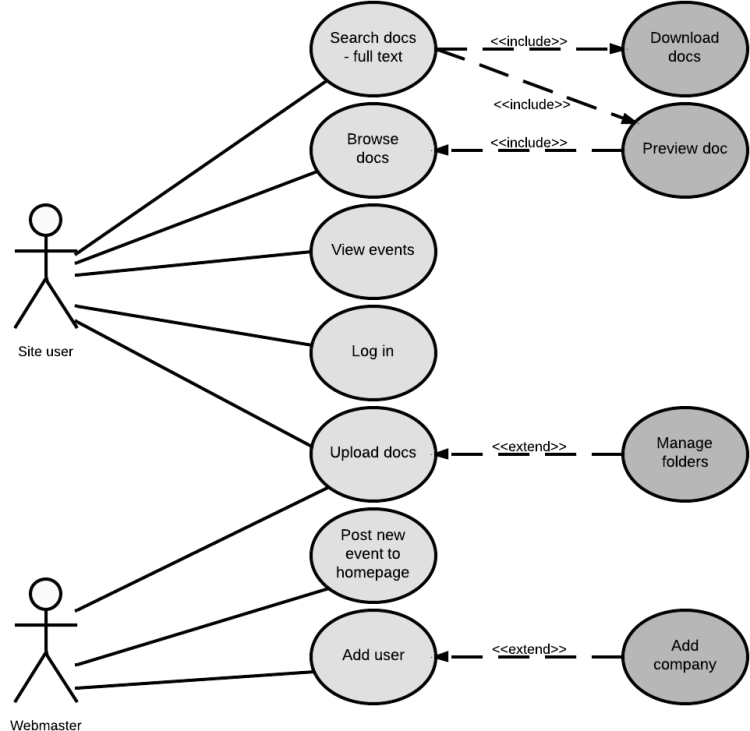

# 2. Diagrammes de Cas d'Utilisation

## Qu'est-ce qu'un Diagramme de Cas d'Utilisation UML ?
Les diagrammes de cas d'utilisation UML récapitulent les interactions entre les utilisateurs et un système. Ils sont utiles pour :
- Illustrer les scénarios d'interaction entre le système et les utilisateurs.
- Définir les objectifs que le système permet d'atteindre.
- Décrire la portée du système.

## Comment Utiliser les Diagrammes de Cas d'Utilisation UML ?
Ces diagrammes offrent une vue d'ensemble des relations entre les cas d'utilisation, les acteurs et les systèmes, et devraient être complétés par des descriptions textuelles. Ils servent à :
- Représenter les objectifs des interactions.
- Organiser les exigences fonctionnelles.
- Préciser le contexte et les exigences d'un système.
- Modéliser le flux d'événements.

## Composants d'un Diagramme de Cas d'Utilisation
Les éléments principaux incluent :
- **Acteurs** : Utilisateurs interagissant avec le système.
- **Système** : Actions et interactions entre les acteurs et le système.
- **Objectifs** : Résultat final des cas d'utilisation.

## Symboles et Notation
- **Cas d'utilisation** : Formes ovales représentant les applications pour un utilisateur.
- **Acteurs** : Figurines représentant les utilisateurs.
- **Associations** : Lignes reliant acteurs et cas d'utilisation.
- **Frontières de Systèmes** : Cadres indiquant la portée des cas d'utilisation.
- **Paquets** : Groupes d'éléments, semblables à des dossiers de fichiers.

## Exemple de diagramme de Cas d'Utilisation
  
[Source : Lucichart](https://www.lucidchart.com/pages/fr/diagramme-de-cas-dutilisation-uml)

## Exercice Pratique de Création de Diagrammes de Cas d'Utilisation

### Contexte
Créer un diagramme de cas d'utilisation pour un système de réservation en ligne pour un hôtel.

### Étapes
- Identifier les Acteurs : Par exemple, clients, personnel de l'hôtel, système de paiement en ligne.
- Définir les Cas d'Utilisation : Réservation d'une chambre, annulation d'une réservation, paiement en ligne, etc.
- Lier les Cas d'Utilisation aux Acteurs : Associer chaque cas d'utilisation avec un ou plusieurs acteurs.
- Décrire les Interactions : Détaillez les principales étapes pour chaque cas d'utilisation.
- Représenter Visuellement : Dessiner le diagramme avec les acteurs et les cas d'utilisation reliés par des lignes.
- Analyser les Liens avec les Exigences : Associer chaque cas d'utilisation à une exigence fonctionnelle spécifique du système.

### Résultat Attendu
Un diagramme complet montrant les interactions entre les acteurs et le système, illustrant clairement comment chaque fonctionnalité du système répond aux besoins des utilisateurs.