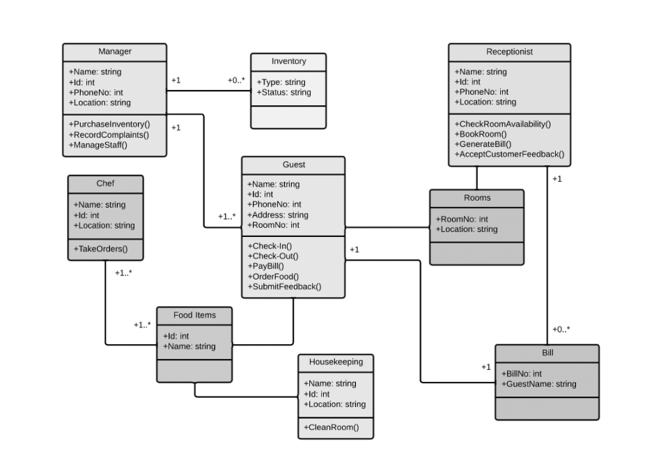

# 3. Diagramme de Classes
Les diagrammes de classes sont au cœur de l'UML et sont cruciaux pour la modélisation orientée objet. Ils représentent la structure statique d'un système en montrant ses classes, leurs attributs, méthodes, et les relations entre ces classes.

## Concepts de Base

### Classes
Une classe est une structure qui définit les attributs (caractéristiques) et méthodes (comportements) communs à un ensemble d'objets. Elle représente un concept ou une entité dans le domaine du problème.
- **Attributs :** Variables ou propriétés stockées dans une classe.
- **Méthodes :** Fonctions ou procédures que les objets d'une classe peuvent effectuer.

*Exemple : La classe Voiture peut avoir des attributs comme modele et couleur, et des méthodes comme demarrer() et arreter().*

### Objets
Un objet est une instance concrète d'une classe. Un objet incarne les caractéristiques définies par la classe.
- **État et Comportement :** Chaque objet possède un état unique (valeurs des attributs) et un comportement (méthodes).

*Exemple : Un objet maVoiture, instance de la classe Voiture, peut avoir `modele = 'Tesla Model 3'` et `couleur = 'rouge'`.*

### Relations entre Classes
Les relations décrivent comment les classes interagissent ou sont connectées entre elles.

1. **Association**  
Une connexion générale entre deux classes, indiquant une relation bidirectionnelle ou unidirectionnelle.  
*Exemple : Une `Personne` peut avoir une association avec `Voiture`, indiquant qu'une personne possède une voiture.*

2. **Agrégation**  
Une forme spéciale d'association qui représente une relation "tout-partie" où la partie peut exister indépendamment du tout.  
*Exemple : `Entreprise` et `Employé`, où les employés peuvent exister séparément de l'entreprise.*

3. **Composition**  
Une forme plus forte d'agrégation où la partie ne peut pas exister sans le tout.  
*Exemple : `Moteur` est une partie essentielle de `Voiture`.*

4. **Héritage**  
Une relation où une classe (sous-classe ou classe dérivée) hérite des caractéristiques d'une autre classe (super-classe ou classe parente).  
*Exemple : `VoitureElectrique` héritant de `Voiture`, reprenant ses attributs et méthodes tout en ajoutant les siens.*
  - **Polymorphisme :** Capacité d'une sous-classe à être traitée comme un objet de sa super-classe, tout en ayant ses propres comportements spécifiques.
  - **Réutilisation de Code :** L'héritage permet de réutiliser et d'étendre les fonctionnalités des classes existantes.

5. **Réalisation**  
La réalisation ou mise en œuvre spécifie qu'une classe réalise l'ensemble des méthodes définies dans une interface. La notion de mise en œuvre dans le contexte d'un diagramme de classes UML fait référence à la façon dont une classe concrétise ou réalise la fonctionnalité définie dans une autre classe ou une interface : une classe peut mettre en œuvre les méthodes et les comportements définis dans une autre classe. Cela signifie qu'elle fournit une implémentation pratique pour ces fonctionnalités.  
*Exemple : La classe `Voiture` peut réaliser une interface `IVehicule` qui définit des méthodes comme `conduire()` et `stationner()`. Les méthodes seront simplement définies dans l'interface, tandis que le code exécutant les actions sera écrit dans la classe qui l'implémente.*

6. **Implémentation**  
Se réfère souvent à l'action d'une classe concrète exécutant les méthodes d'une interface. Lorsque l'on parle de mise en œuvre dans un diagramme de classes UML, cela fait généralement référence à l'implémentation d'interfaces ou de contrats définis dans une classe par une autre classe. Les interfaces sont des contrats abstraits qui spécifient les méthodes que les classes concrètes doivent implémenter. Dans ce contexte, une classe qui implémente une interface s'engage à fournir une implémentation concrète pour les méthodes déclarées dans cette interface.  
*Exemple : `Voiture` implémentant l'interface `IVehicule`.*

7. **Dépendance**  
Une dépendance est une relation où une classe dépend d'une autre pour fonctionner, mais cette dépendance est généralement de courte durée ou moins formelle.  
*Exemple : La classe `Conducteur` peut avoir une dépendance à la classe `Voiture` pour sa méthode `conduire()`.*

## Notation et Syntaxe
### Classes
Rectangles divisés en trois sections (nom, attributs, méthodes). Les attributs et méthodes sont souvent précédés de symboles pour indiquer leur visibilité. Toutes les classes ont des niveaux d'accès différents, en fonction du modificateur d'accès (indicateur de visibilité). Voici les niveaux d'accès existants et les symboles qui leur sont associés :
- public: `+`
- private: `-`
- protected: `#`
- package: `~`
- derived: `/`
- static: souligné

### Représentation d'une Classe dans un diagramme UML

### Relations
- **Association :** Ligne simple, souvent avec des noms de rôles et des multiplicités (par exemple, `1..*` pour plusieurs).
- **Agrégation :** Ligne avec un losange blanc à une extrémité, indiquant le tout.
- **Composition :** Ligne avec un losange noir, indiquant une dépendance plus forte entre les parties.
- **Héritage :** Ligne avec une flèche ouverte pointant vers la super-classe.

### Représentation des Relations entre Classes dans un diagramme UML

## Exemple de diagramme de Classes
  
[Source : Lucichart](https://www.lucidchart.com/pages/fr/diagramme-de-classes-uml)

## Exercice Pratique de Modélisation de Classes

### Contexte
Modéliser un système de gestion de bibliothèque.

### Étapes
- Identifier les Classes Principales.
- Définir les Attributs et Méthodes.
- Établir les Relations.
- Représenter le Diagramme.

### Résultat Attendu
Un diagramme de classes UML illustrant la structure du système de gestion de bibliothèque, y compris les relations entre les classes.