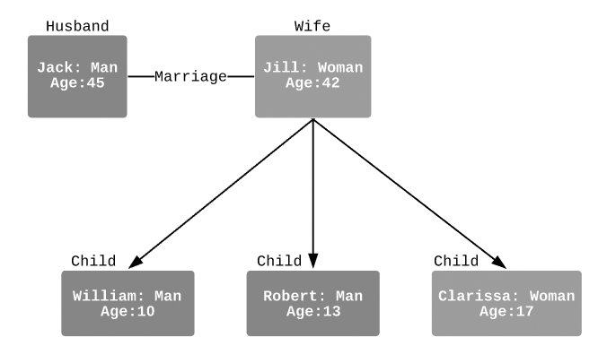

# 4. Diagramme d'Objets
Le diagramme d'objets en UML est un outil crucial pour la modélisation et la visualisation des aspects dynamiques des systèmes orientés objet. Il sert essentiellement à représenter des "instantanés" du système à un moment donné, montrant l'état concret des objets ainsi que leurs relations inter-objectifs. Contrairement au diagramme de classes, qui présente une vue abstraite et statique des classes et de leurs relations, le diagramme d'objets se concentre sur des instances spécifiques de classes, avec leurs attributs et leurs états actuels. Cela en fait un excellent outil pour illustrer des scénarios spécifiques du système, comme l'état des objets après certaines opérations ou interactions. Dans la pratique, les diagrammes d'objets sont fréquemment utilisés pour le débogage, la documentation de cas d'utilisation particuliers, ou pour compléter les diagrammes de classes en fournissant une perspective plus tangible sur le fonctionnement interne du système. Ils sont particulièrement utiles dans les phases de test et d'analyse, où comprendre l'état actuel des objets et leurs interactions est essentiel.

## Différence entre Diagrammes de Classes et d'Objets

### Diagrammes de Classes
- Définition : Représentent la structure statique d'un système, montrant les classes, leurs attributs, méthodes, et les relations entre elles (association, héritage, etc.).  
*Exemple : Un diagramme de classe pourrait montrer une classe `Voiture` avec des attributs comme `modele` et `couleur` et des méthodes comme `demarrer()` et `arreter()`.*
- Utilité : Idéal pour la modélisation de la conception d'un système, la définition des structures de données et la planification de l'architecture logicielle.

### Diagrammes d'Objets
- Définition : Montrent des instances de classes (objets) à un moment spécifique. Ils sont comme des "instantanés" du système, montrant l'état des objets et leurs relations à un moment donné.  
*Exemple : Un diagramme d'objet pourrait illustrer un objet `maVoiture` de la classe `Voiture` avec `modele = 'Tesla Model 3'` et `couleur = 'rouge'`.*
- Utilité : Utile pour visualiser et comprendre l'état et les interactions des objets durant l'exécution d'un système, souvent employé pour le débogage ou la documentation de cas spécifiques.

## Utilisation Pratique des Diagrammes d'Objets

### Visualisation de Scénarios Spécifiques
Les diagrammes d'objets sont parfaits pour illustrer des situations particulières ou des cas d'utilisation spécifiques dans un système.  
*Exemple : Montrer l'état des objets après une série d'opérations, comme après la création, modification ou suppression d'objets dans un système de gestion de bibliothèque.*

### Analyse et Débogage
Ils permettent aux développeurs de voir l'état actuel des objets et de comprendre comment différents objets interagissent entre eux dans un scénario donné.  
*Exemple : Utilisé pour déterminer pourquoi un certain objet n'a pas l'état attendu dans une application, facilitant la localisation des erreurs.*

### Complément aux Diagrammes de Classes
Ils offrent une vision plus concrète et spécifique qui complète les diagrammes de classes, permettant de mieux comprendre comment les classes sont utilisées en pratique.  
*Exemple : Comparer le diagramme de classe général avec un diagramme d'objet pour un cas d'utilisation particulier dans un système de commande en ligne.*

## Exemple de diagramme d'Objets
  
[Source : Lucichart](https://www.lucidchart.com/pages/fr/diagramme-dobjets-uml)

## Exercice Pratique de Modélisation d'Objets

### Contexte
Modéliser un scénario spécifique dans un système de gestion de bibliothèque.

### Étapes
- Sélectionner un Scénario Spécifique : Par exemple, le processus d'emprunt d'un livre par un emprunteur.
- Identifier les Objets Spécifiques : Inclure des instances spécifiques de classes telles que Livre, Auteur, Emprunteur, Emprunt.
- Définir l'État des Objets :
  - Livre : Attributs tels que titre = 'Les Misérables', auteur = 'Victor Hugo', ISBN = '123-456789', disponible = False.
  - Auteur : Attributs comme nom = 'Victor Hugo', biographie = '...'.
  - Emprunteur : Attributs comme nom = 'Jean Dupont', adresse = '123 Rue de la Paix'.
  - Emprunt : Attributs tels que livre = Les Misérables, dateEmprunt = '01/01/2023', dateRetour = '15/01/2023'.
- Représenter les Relations entre Objets :
  - Montrer la relation entre l'objet Emprunteur et l'objet Emprunt.
  - Illustrer comment l'objet Livre est lié à l'objet Emprunt.

### Résultat Attendu
Un diagramme d'objets UML détaillant un instantané du système de gestion de bibliothèque pendant le processus d'emprunt d'un livre. Le diagramme devrait montrer les états spécifiques des objets concernés (par exemple, un livre particulier, son emprunteur et les détails de l'emprunt) et comment ces objets interagissent dans ce scénario précis.