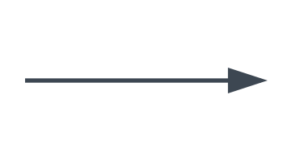
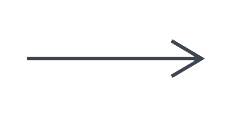
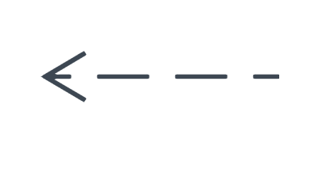
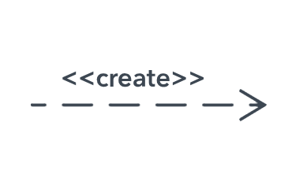
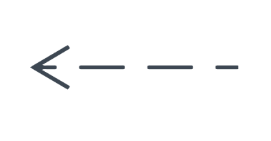
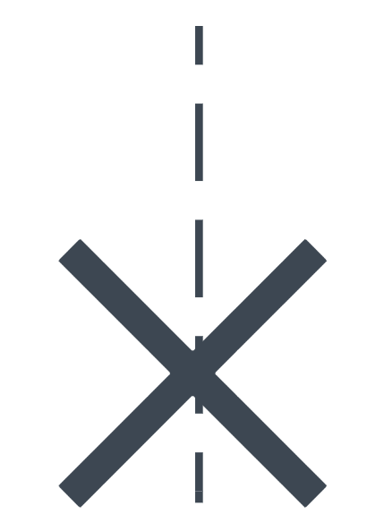
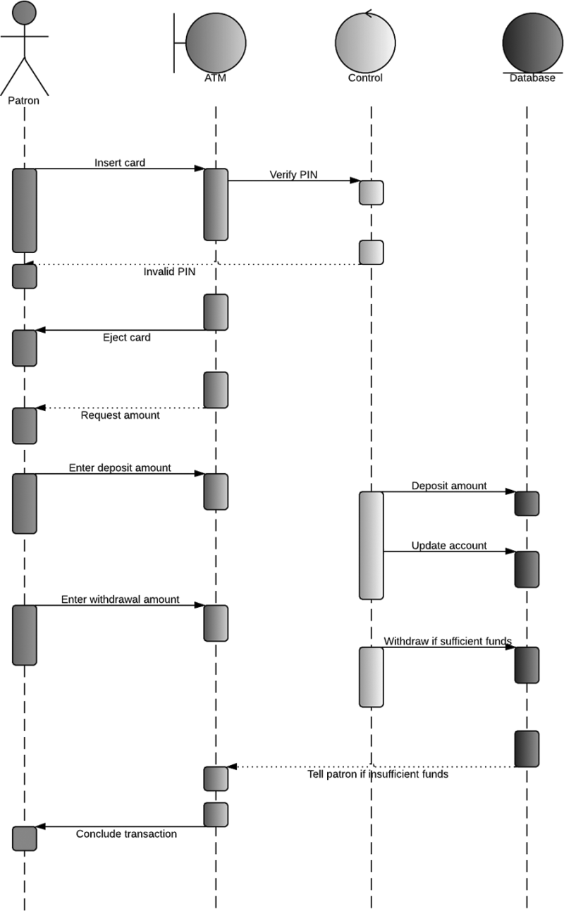

# 6. Diagrammes de Séquence
Les diagrammes de séquence en UML sont utilisés pour illustrer comment les objets interagissent dans un système, en mettant l'accent sur l'ordre temporel des messages.  
Ils sont particulièrement utiles pour visualiser le flux de contrôle dans des scénarios spécifiques, permettant de comprendre comment les différents éléments d'un système collaborent pour réaliser une fonctionnalité.
Importance des Interactions.  
Ces diagrammes montrent non seulement les interactions entre les objets mais aussi comment ces interactions se déroulent dans le temps.  
Ils sont essentiels pour décomposer des processus complexes en séquences d'actions plus simples, facilitant ainsi la compréhension et l'analyse des processus.

## Notation et Construction de Diagrammes de Séquence

### Éléments Clés
- **Objets/Acteurs :** Représentés par des rectangles en haut du diagramme.
- **Lignes de Vie :** Des lignes verticales descendantes des objets, représentant le temps qui passe.
- **Messages :** Représentés par des flèches horizontales entre les lignes de vie, indiquant la communication ou l'interaction entre les objets.
- **Barres d'Activation :** Des rectangles minces sur une ligne de vie, indiquant la période pendant laquelle un objet est actif ou contrôle le processus.

### Construction d'un Diagramme de Séquence
- Commencer par identifier les objets ou acteurs impliqués dans le scénario.
- Tracer les lignes de vie pour chaque objet.
- Ajouter les messages dans l'ordre où ils se produisent, en respectant la chronologie.
- Utiliser des barres d'activation pour montrer quand un objet est actif.

### Symboles de messages courants
Utilisez les flèches et les symboles de messages suivants pour indiquer comment les informations sont transmises entre des objets. Ces symboles peuvent représenter le début et l'exécution d'une opération, ou l'envoi et la réception d'un signal.  

#### Message synchrone
Représenté par une ligne pleine terminée par une pointe de flèche pleine. On utilise ce symbole lorsqu'un expéditeur doit attendre une réponse à un message avant de continuer. Le diagramme doit montrer à la fois l'appel et la réponse.  

#### Message asynchrone
Représenté par une ligne pleine terminée par une pointe de flèche. Les messages asynchrones ne nécessitent pas de réponse avant que l'expéditeur ne continue. Seul l'appel doit être inclus dans le diagramme.  

#### Message de retour asynchrone
Représenté par une ligne en pointillés terminée par une tête de flèche.  

#### Message de création asynchrone
Représenté par une ligne en pointillés terminée par une pointe de flèche. Ce message crée un nouvel objet.  

#### Message de réponse
Représenté par une ligne en pointillés terminée par une pointe de flèche, ce message est une réponse à un appel.  

#### Message suppression
Représenté par une ligne pleine terminée par une pointe de flèche pleine, suivie du symbole X. Ce message détruit un objet.  

## Exemple de diagramme de Séquence
  
[Source : Lucichart](https://www.lucidchart.com/pages/fr/diagramme-de-sequence-uml)

## Exercice Pratique de Création d'un Diagramme de Séquence

### Contexte
Modélisation d'un scénario de commande en ligne dans un système e-commerce.

### Étapes
- Identifier les Objets/Acteurs.
- Modéliser le Scénario.
- Représenter le Diagramme.

### Résultat Attendu
Un diagramme de séquence montrant clairement l'ordre des interactions et le flux du processus de commande en ligne.