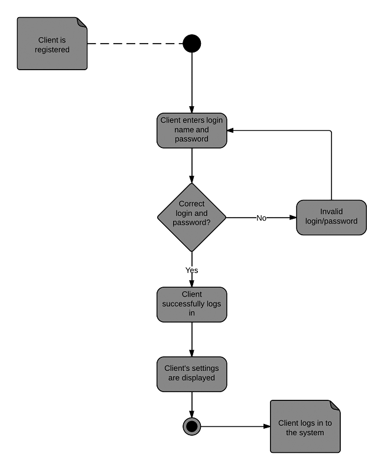

# 06 - Diagramme d'Activités
Les diagrammes d'activités en UML sont utilisés pour modéliser les processus d'affaires et les flux de travail. Ils illustrent les étapes séquentielles ou parallèles d'un processus et sont particulièrement utiles pour visualiser des opérations complexes.  
Ces diagrammes aident à comprendre comment différentes actions et décisions s'enchaînent pour compléter un processus. Ils sont souvent employés pour modéliser des processus d'affaires, des cas d'utilisation ou des algorithmes.

## Syntaxe et Éléments des Diagrammes d'Activités

### Éléments Clés
- Nœuds d'Activité : Représentent les actions dans un processus.
- Nœuds de Décision : Points où des décisions sont prises, généralement représentés par des losanges.
- Flèches/Transitions : Indiquent le flux d'une activité à l'autre.
- Nœuds de Fin : Marquent la fin d'un processus d'activité.
- Barres de Synchronisation : Représentent le parallélisme et la synchronisation dans un processus.

### Construction d'un Diagramme
- Identifier les principales activités et décisions dans le processus.
- Organiser les activités en séquence ou en parallèle, selon le flux du processus.
- Utiliser les nœuds de décision pour les points où des chemins alternatifs sont possibles.
- Connecter les activités avec des flèches pour indiquer le flux de contrôle.

## Exemple de diagramme d'Activités
  
[Source : Lucichart](https://www.lucidchart.com/pages/fr/diagramme-dactivite-uml)

## Exercice Pratique : Création d'un Diagramme d'Activités

### Contexte
Modélisation du processus de traitement des commandes dans une entreprise de vente en ligne.

### Étapes
- Identifier les Activités Principales.
- Inclure les Décisions.
- Représenter le Diagramme.

### Résultat Attendu
Un diagramme d'activités détaillé décrivant le processus de traitement des commandes, depuis la réception jusqu'à la notification au client.