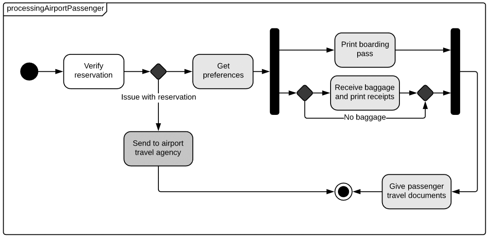

# 7. Diagramme d'État
Les diagrammes d'état, aussi connus sous le nom de diagrammes d'états-transitions, sont utilisés en UML pour modéliser le comportement dynamique des objets. Ils illustrent comment un objet change d'état en réponse à des événements internes ou externes.  
Ces diagrammes sont cruciaux pour comprendre le cycle de vie d'un objet, en particulier dans des systèmes complexes où le comportement de l'objet change de manière significative en réponse à des événements.

## États, Transitions, Événements

### États
Un état représente une condition ou une situation pendant la vie d'un objet dans laquelle il satisfait à certaines conditions, effectue une activité spécifique, ou attend un événement.
*Exemple : Dans un système de gestion de commande, un produit peut avoir des états tels que "En Stock", "En Cours de Réapprovisionnement", "Épuisé".*

### Transitions
Une transition est le passage d'un état à un autre. Elle est déclenchée par des événements.
*Exemple : La transition de l'état "En Stock" à "Épuisé" peut être déclenchée par l'événement "stock épuisé".*

### Événements
Un événement est un occurrence significative qui a un effet spécifique sur l'état de l'objet.
*Exemple : Une commande client peut être un événement déclencheur pour la vérification du stock d'un produit.*

## Exemple de diagramme d'État Transition
  
[Source : Lucichart](https://www.lucidchart.com/pages/fr/diagramme-etats-transitions-uml)

## Exercice Pratique de Création d'un Diagramme d'État

### Contexte
Modélisation du cycle de vie d'une commande dans un système de commerce électronique.

### Étapes
- Identifier les États Principaux de la Commande.
- Définir les Transitions et Événements.
- Construire le Diagramme.
- Ajouter des transitions vers d'autres états en fonction des événements.

### Résultat Attendu
Un diagramme d'état décrivant les différents états par lesquels passe une commande et les transitions en fonction des actions du client ou du système.