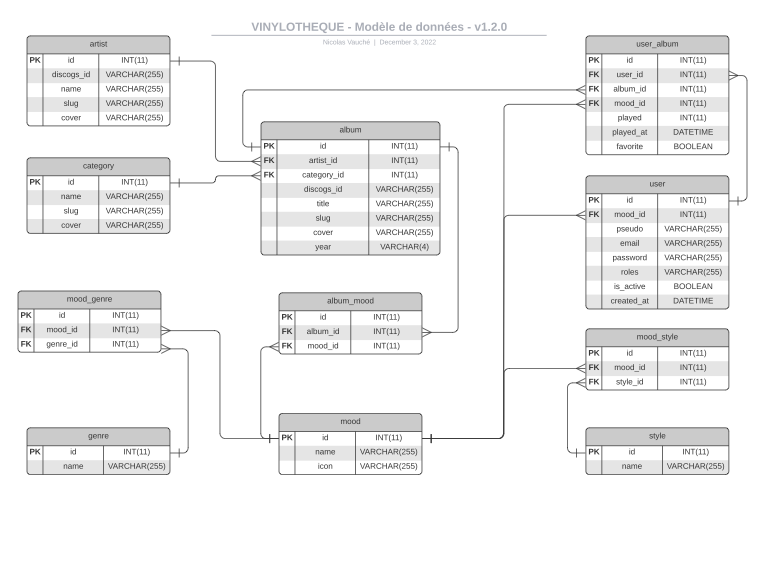

# 09 - Modèles de base de données

Un modèle de base de données illustre la structure logique d'une base de données, incluant les relations et les contraintes qui déterminent comment les données peuvent être stockées et accessibles.

## Types de modèles de bases de données

- Modèle de base de données hiérarchique
- Modèle relationnel
- Modèle réseau
- Modèle de base de données orientée objet
- Modèle entité-association
- Modèle document
- Modèle entité-attribut-valeur
- Schéma en étoile
- Modèle relationnel-objet;

### Modèle relationnel

Le modèle relationnel trie les données dans des tables (relations), avec des colonnes (attributs) et des lignes (tuples). Il inclut des concepts comme la clé primaire et la clé étrangère, et gère des relations comme un-à-un, un-à-plusieurs, et plusieurs-à-plusieurs.

### Modèle hiérarchique

Le modèle hiérarchique organise les données dans une structure arborescente, avec des enregistrements ayant un seul parent (racine).

### Modèle réseau

Le modèle réseau étend le modèle hiérarchique pour autoriser des relations plusieurs-à-plusieurs entre les enregistrements.

### Modèle de base de données orientée objet

Ce modèle définit une base de données comme une collection d'objets avec des caractéristiques et des méthodes, adapté pour des bases de données multimédia ou hypertextuelles.

### Modèle relationnel-objet

Un hybride qui combine le modèle relationnel avec des fonctionnalités avancées du modèle orienté objet.

### Modèle entité-association

Reproduit les relations entre les entités du monde réel, utilisé pour la création conceptuelle de bases de données.

### Autres modèles

- Modèle de fichier inversé
- Modèle de base de données orientée texte
- Modèle multidimensionnel
- Modèle semi-structuré
- Modèle contextuel
- Modèle d'association;

### Modèles de bases de données NoSQL

- Modèle de base de données orienté graphe
- Modèle multivaleur
- Modèle orienté document

## Exemple de Modèle de base de données Entités-Relations
  
[Source : Lucichart](https://www.lucidchart.com/pages/fr/quest-ce-quun-modele-de-base-de-donnees)

## Bases de données sur le Web

Les sites Web utilisent des bases de données pour organiser et présenter des données, souvent connectées à un serveur Web via un middleware.
